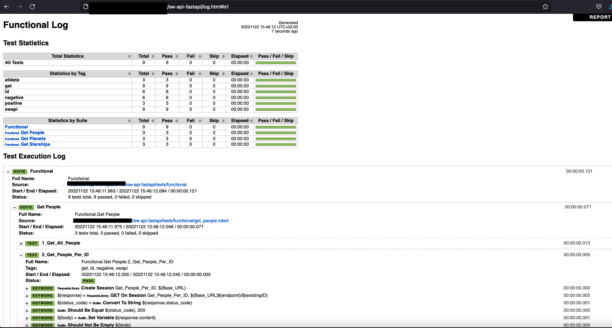
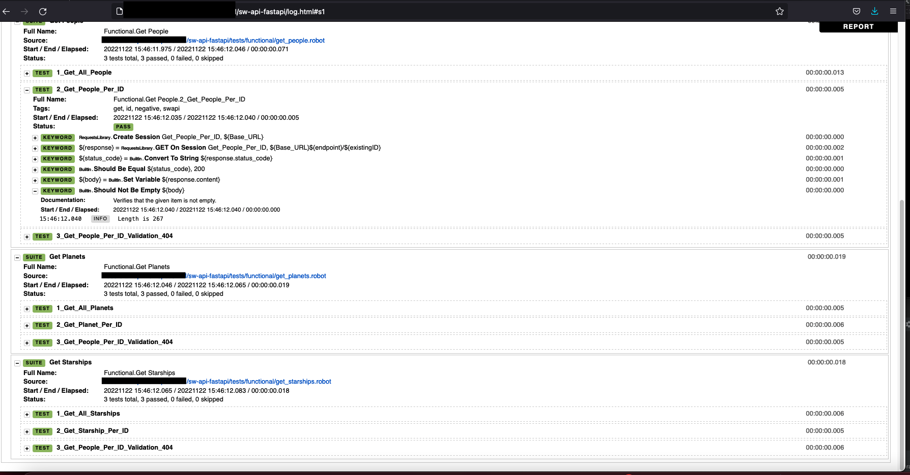

## Notes
A detailed go-through on setting up python, robot and developing the application and test automation framework for Star wars project

### Setup

- Setup local environment. 
```
 # Create a virtual env with venv and activate it   
➜  python3 -m venv .venv     
➜  source ./.venv/bin/activate 

# store dependencies with pip
(venv) ➜  pip install fastapi
(venv) ➜  pip install "uvicorn[standard]"
(venv) ➜  pip install robotframework "
(venv) ➜  pip install robotframework-requests"

# Export dependencies in python's requirements.txt file
pip3 freeze > requirements.txt
```

## Development
- Created a python module in [app.py](../app.py) 
- Run an instance using one of the requirements' packages
``` 
(.venv) ➜  sw-api-fastapi git:(main) ✗ uvicorn app:app 

INFO:     Started server process [56525]
INFO:     Waiting for application startup.
INFO:     Application startup complete.
INFO:     Uvicorn running on http://127.0.0.1:8000 (Press CTRL+C to quit)
```
Option `uvicorn app:app --reload` restarts the server after code changes.

- Copied the swapi data from [swapi GitHub repo resources folder](https://github.com/phalt/swapi/tree/master/resources/fixtures), 
into a [local folder](../resources), in order to keep them as an in-memory storage solution.
This is a quick and simplistic storage approach. 
<br>A much better solution would be to implement a relational database, using e.g. Flask or Django.
<br>In order to keep the data of a minimal size, the json files with people, planets and starships contain only 5 entries each, keeping those based on existing relationships with the people objects.

- Added 404 exception handling.
- Added a logging mechanism. 
<br> This is not complete though. It is also needed to have a dedicated log file, where every server traffic logged action would be registered.

```
### Extract from info level log messages
22-Nov-22 01:37:38:f - -INFO - People data loaded from json file
INFO:     Started server process [58525]
INFO:     Waiting for application startup.
INFO:     Application startup complete.
INFO:     127.0.0.1:58073 - "GET /people HTTP/1.1" 200 OK
22-Nov-22 01:38:00:f - -INFO - Found the person with id 1
INFO:     127.0.0.1:58074 - "GET /people/1 HTTP/1.1" 200 OK

### Extract when requesting a non-existent people id
22-Nov-22 01:39:19:f - -WARNING - Requesting people with 6 not successful
INFO:     127.0.0.1:58076 - "GET /people/6 HTTP/1.1" 200 OK
```
<i>ToDo</i>: Extend logging mechanism to store logged server traffic in a dedicated file

- Installed robot through pip and updated requirement.txt file
- Developed functional tests in folder [tests/functional](../tests/functional).
<br> Generally the best practice with Robot is to create a resources' folder, where variables and settings are declared as helper entities for all tests
- As tests were developed such as [get_people.robot](../tests/functional/get_people.robot), each of the files were run with the command `robot ./tests/functional/get_people.robot`
<br> The command to run them all is `robot ./tests/functional/`

- Test execution reports are nicely displayed in the `log.html` file generated from robot. Following screenshots show one of the last local test executions:



## Test analysis
The functional test cases implemented describe the simple flows of interacting with the exposed API, in the level of black-box, acceptance testing.
<br>A basic happy path and a negative scenario for the 404 status code have been written, for each of all 3 of data types, for the respective endpoints exposed.
<br>The selection of test data is hardcoded, as it is easy to be decided through the existing json files.
<br>Robot handles the test result logging in an elegant manner, by printing the execution status of each test in the console,as well as by saving the test suite execution in the `log.html file`, in project's root directory.

## References
- Official FastAPI [tutorial](https://github.com/phalt/swapi/tree/master/resources/fixtures)
- swapi data from [Github repo](https://github.com/phalt/swapi/tree/master/resources/fixtures)
- Logging in Python - [RealPython](https://realpython.com/python-logging/)
- Logging in Python 3 - [Official docs](https://docs.python.org/3/howto/logging.html)
- Robot Framework [User Guide](https://robotframework.org/robotframework/latest/RobotFrameworkUserGuide.html)
- robot keyword: [Status should be](https://robotframework-requests.netlify.app/doc/requestslibrary#Status%20Should%20Be)
- Robot Framework Swarm [repository](https://github.com/damies13/rfswarm) ( To be used for the performance testing )

## Important missing features

#### Important for Server Application
- [ ] The REST server should ideally retrieve data from a relational database, such as Django or with Flask. 
<br>Currently resources folder holds 3 json files with a small subset of swapi's data
- [ ] Application code is in a single file, violating best practices on code modularity and functionality independence.
<br> In a next iteration, a refactoring on projects structure, especially after implementing a proper database for the data would be essential.
- [ ] For the existing logging mechanism, currently prints logs only on console and are visible during application running. A separate log file should be created and dynamically updated on every fresh restart.

#### Important for Functional Test suite with Robot
- [ ] It would be essential to add a mechanism that prepares the test environment by starting the http server at the start of.
- [ ] It would be essential to add a mechanism that shuts down the environment after test execution is complete

#### Important for Performance Testing
- [ ] The API server misses a performance testing suite
- [ ] It would be essential to be able to prepare the test environment by starting the http server at the start and shut it down after the execution. 
- [ ] It would be interesting as a test suite, to access one of the end-points continuously for a time duration e.g. 1 minute (sequential access is fine) and keep track of the response time on the client side.
- [ ] It would be interesting to keep as performance testing metrics the mean & standard deviation of the response time for the end-point.


## Improvements
#### Quality suggestions for server app
- Based on the above, it would be important to add unit tests, in order to white test the functions and modules of the application code.
- It would be also very important to have a linting task to statically check the code.
- The above checks should be included in a CI pipeline and be used as quality gates. Since repo is already on GitHub, GH actions would be a great tool for CI tasks.

#### Quality suggestions for the app and test automation suite bundle
- Dockerize the application and test automation suite. 
<br> A simple docker compose would be good enough.
<br> With a dockerized container the whole bundle can run on every platform, with the only prerequisite being docker.
<br> Containerizing the application and the test automation suites is important to make them infrastructure-agnostic. 
<br> It makes it a lot easier to utilise the project in a full software life cycle process that also contains CD pipelines with tools like Jenkins or ArgoCD.
- Use a MAKEFILE to store some useful commands for both development and testing tasks.